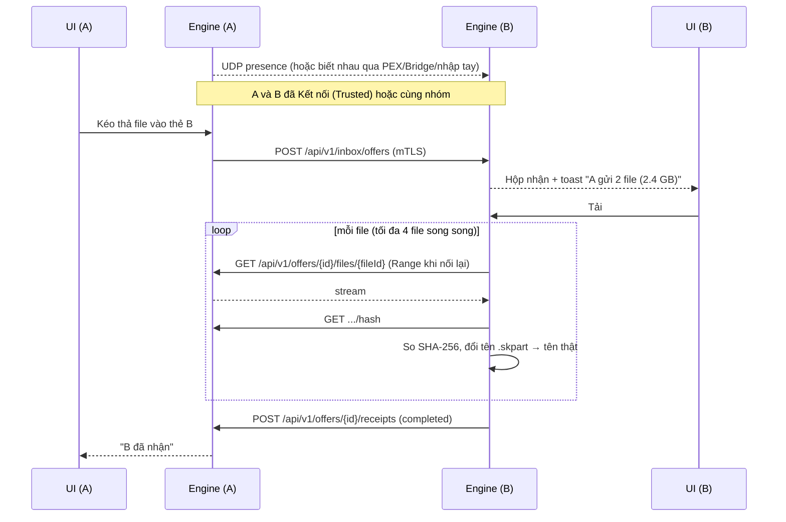

# 02 — Kiến trúc

## 1. Nguyên tắc

1. **Không có server.** Mọi máy chạy cùng một app, vừa là client vừa là server (Kestrel nhúng).
2. **Vai trò theo hành động, không theo máy.** Người gửi phục vụ file của mình; người tạo nhóm làm **Host** quản lý thành viên. Bất kỳ client nào cũng có thể bật thêm vai trò **Bridge** (xem [08](08-host-roles.md)).
3. **Người gửi sở hữu, người nhận tự quyết.** Gửi là copy. Người nhận kéo dữ liệu về và giữ vĩnh viễn.
4. **Mặc định từ chối.** Peer chưa tin cậy chỉ được xin phép ([04 §3](04-identity-security.md)).
5. **Đơn giản trước.** Không lưu tiến độ qua lần khởi động lại, không tải từ nhiều nguồn, không đồng bộ phân tán. Rớt mạng ngắn thì nối lại trong cùng phiên chạy.
6. **Tách phần phụ thuộc hệ điều hành** sau interface để port Linux/macOS sau này.

## 2. Sơ đồ thành phần

```text
┌──────────────────────────── Shorekeeper.exe ────────────────────────────────┐
│                                                                             │
│   Desktop Shell: Avalonia UI · Tray · Toast · Kéo thả · Single-instance     │
│                 │ Commands / Events (in-process)                            │
│  ┌──────────────▼─────────────────────── Engine ─────────────────────────┐  │
│  │  Identity ── TrustStore                                               │  │
│  │                                                                       │  │
│  │  Discovery ─┬─ Multicast          (cùng subnet)                       │  │
│  │             ├─ KnownEndpoints     (địa chỉ đã từng kết nối)           │  │
│  │             ├─ PeerExchange       (peer kể cho nhau)                  │  │
│  │             ├─ GroupHost          (Host nhóm cho biết thành viên)     │  │
│  │             ├─ Bridge             (client bật vai trò Bridge)         │  │
│  │             ├─ SubnetProbe        (quét dải IP cấu hình)              │  │
│  │             └─ Manual             (IP/hostname nhập tay)              │  │
│  │                      ▼                                                │  │
│  │             PeerDirectory ──► Connector (chọn địa chỉ, mTLS)          │  │
│  │                                                                       │  │
│  │  Api (Kestrel, mTLS) ─► AccessPolicy (Any/Member/Trusted/Recipient)   │  │
│  │  Pairing · Offers (gửi) · Inbox + Downloader (nhận) · Groups · Bridge │  │
│  │  Storage (SQLite) · EventBus                                          │  │
│  └───────────────────────────────────────────────────────────────────────┘  │
│  Platform abstraction: ISecretProtector INetworkInfo IFirewallInspector     │
│                        IFileTagger INotifier IAutoStart IPolicyProvider     │
│                        IDirectoryInfo (AD, tùy chọn)                        │
└─────────────────────────────────────────────────────────────────────────────┘
```

## 3. Cấu trúc solution

```text
Shorekeeper/
├── docs/
├── src/
│   ├── Shorekeeper.Core/              ← domain, DTO giao thức, crypto, interface. Không I/O mạng.
│   ├── Shorekeeper.Engine/            ← discovery, API, transfers, groups, bridge, storage
│   ├── Shorekeeper.Platform.Windows/  ← DPAPI, firewall, MOTW, toast, auto-start, AD
│   └── Shorekeeper.Desktop/           ← Avalonia app (MVVM), composition root
├── tests/
│   ├── Shorekeeper.Core.Tests/
│   ├── Shorekeeper.Engine.Tests/
│   ├── Shorekeeper.Platform.Windows.Tests/
│   └── Shorekeeper.IntegrationTests/  ← (từ M1) nhiều Engine trong 1 process trên loopback
├── installer/                         ← WiX (MSI)
└── Shorekeeper.sln
```

```text
Desktop ──► Engine ──► Core ◄── Platform.Windows
   └──────────────────────────────► Platform.Windows (đăng ký DI)
```

- `Core` không tham chiếu ASP.NET Core và không tham chiếu Windows.
- `Engine` tham chiếu `Microsoft.AspNetCore.App` để nhúng Kestrel.
- Engine có thể chạy headless (không UI) cho integration test và cho chế độ `--headless` sau này.

## 4. Công nghệ

| Hạng mục | Lựa chọn | Lý do |
|---|---|---|
| Runtime | **.NET 10 (LTS)** | LTS hiện hành, chạy Win/Linux/Mac |
| UI | **Avalonia 12** + CommunityToolkit.Mvvm | Cross-platform, XAML quen thuộc (ADR-002) |
| Hosting | Generic Host | DI, config, logging, BackgroundService |
| HTTP server | Kestrel nhúng, Minimal APIs | mTLS, streaming hiệu quả |
| HTTP client | `HttpClient` + `SocketsHttpHandler` | Kiểm tra cert tùy biến, pool kết nối |
| Serialize | System.Text.Json + source generator | Nhanh, hợp trimming |
| DB | SQLite (`Microsoft.Data.Sqlite`) + Dapper | Nhẹ, 1 file |
| Crypto | ECDSA P-256, SHA-256, TLS 1.3 | Có sẵn trong BCL |
| Logging | Serilog | File xoay vòng |
| Test | xUnit v3 (Microsoft.Testing.Platform), `Assert` có sẵn | Không thêm thư viện assertion; `dotnet test --solution Shorekeeper.sln` |
| Installer | WiX (MSI) | GPO/Intune, tham số lúc cài |

## 5. Mô hình tiến trình

- **Một tiến trình / người dùng Windows**. Chặn chạy trùng bằng named `Mutex` + named pipe. Lần mở thứ hai (vd: "Gửi bằng Shorekeeper" từ Explorer) chuyển đường dẫn file cho tiến trình đang chạy.
- Đóng cửa sổ thì thu xuống tray, Engine vẫn chạy (để nhận file, để Host nhóm tiếp tục hoạt động).
- **Thoát app hẳn** thì mọi lượt tải đang chạy chuyển Lỗi; offer của mình tạm không tải được (vẫn mở, sẽ phục vụ lại khi mở app nếu chưa hết hạn); nhóm mình Host hiện "Host offline".

## 6. Engine — các module

| Module | Trách nhiệm |
|---|---|
| Identity | Sinh/lưu/nạp khóa thiết bị, cert TLS tự ký |
| TrustStore | Liên hệ tin cậy, chặn, cài đặt riêng từng peer |
| Discovery | Các `IDiscoverySource` → `PeerSighting` |
| PeerDirectory | Trạng thái hợp nhất của mọi peer, địa chỉ ứng viên |
| Connector | Chọn địa chỉ, happy-eyeballs, pin DeviceId, `HttpClient` theo peer |
| Api | Endpoint HTTPS cho peer khác gọi vào |
| AccessPolicy | Kiểm tra quyền mọi request theo mức quan hệ; rate limit với Unknown |
| Pairing | Xin / chấp nhận / ngắt kết nối |
| Offers | Phía gửi: tạo offer, giao cho người nhận (kể cả khi họ online sau), phục vụ file (Range), hash cache, snapshot, thu hồi, hết hạn |
| Inbox + Downloader | Phía nhận: Hộp nhận, tải, nối lại khi rớt mạng, verify, đổi tên |
| Groups | `GroupHostService` (khi mình là Host), `GroupMemberService` (khi mình là thành viên) |
| BridgeRegistry | Registry presence khi bật vai trò Bridge |
| Storage | SQLite, migration, repository |
| EventBus | Sự kiện cho UI (peer online, offer đến, tiến độ…) |

Giao tiếp Shell ↔ Engine: Shell gọi application service (`ITransferService.SendAsync(peers, paths)`). Engine đẩy trạng thái qua `IEventBus`. Tiến độ được gộp ≤ 4 lần/giây.

## 7. Luồng chính: A gửi file cho B



## 8. Xử lý lỗi

- Mọi thao tác mạng có timeout.
- Tải file rớt giữa chừng → **nối lại và tải tiếp bằng Range** trong cửa sổ 60 giây; quá thì Lỗi ([06 §5](06-file-transfer.md)).
- Request điều khiển (giao offer, receipts, hello) được retry nhẹ với backoff. Giao offer thất bại vì người nhận offline thì để lại, giao khi họ online.
- Lỗi trả về dạng `application/problem+json` với `code` ổn định ([05](05-protocol.md)).
- Khởi động app thì dọn mọi file `.skpart` còn sót và đánh dấu Lỗi các transfer chưa kết thúc.

## 9. Port sang Linux/macOS

| Phần | Windows | Linux/macOS |
|---|---|---|
| Bảo vệ khóa | DPAPI | libsecret / Keychain |
| Firewall | Rule qua installer | Hướng dẫn / prompt của hệ thống |
| Thông báo | Windows Toast | libnotify / UserNotifications |
| Auto-start | HKCU Run | XDG autostart / LaunchAgent |
| Mark of the Web | ADS `Zone.Identifier` | xattr quarantine (mac) |
| AD | System.DirectoryServices | Không hỗ trợ (hoặc LDAP thuần) |
