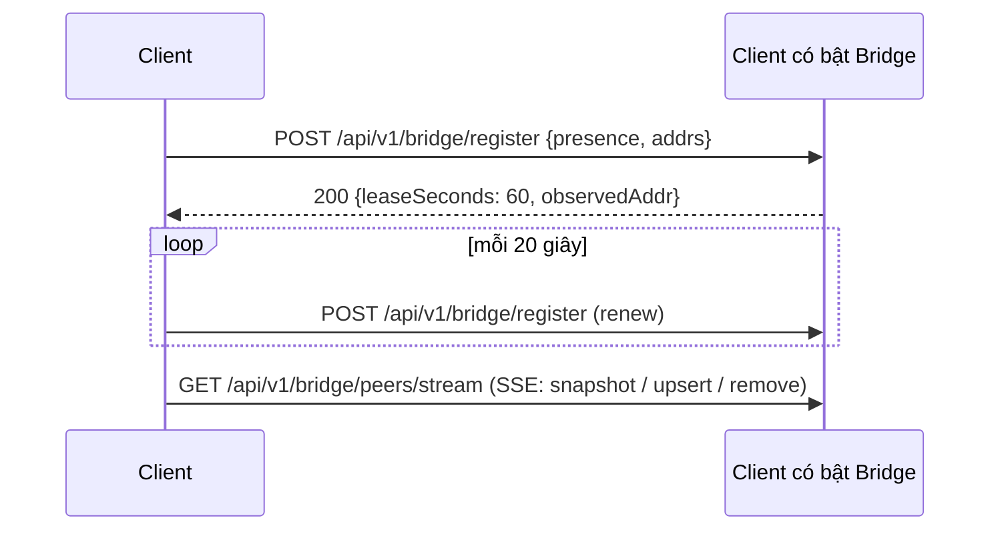

# 03 — Discovery & Presence

> Yêu cầu liên quan: FR-01 → FR-05, NFR-02, NFR-03.

## 1. Vấn đề

- **Cùng subnet:** UDP multicast chạy tốt, không cần cấu hình.
- **Khác subnet:** router không chuyển multicast. Nhưng **unicast TCP/UDP giữa các subnet thường vẫn định tuyến được**, nên chỉ cần *biết địa chỉ* của nhau.
- **Không có server trung tâm.** Thông tin địa chỉ phải lan truyền giữa chính các client.

## 2. Các nguồn discovery

| # | Nguồn | Phạm vi | Cần cấu hình? | Mặc định |
|---|---|---|---|---|
| 1 | **Multicast** | Cùng subnet | Không | Bật |
| 2 | **Known Endpoints** | Máy đã từng kết nối | Không (tự ghi nhớ) | Bật |
| 3 | **Peer Exchange (PEX)** | Lan qua peer | Không | Bật |
| 4 | **Group Host** | Thành viên cùng nhóm | Không (vào nhóm là có) | Bật |
| 5 | **Bridge** | Toàn mạng | Một client bật vai trò Bridge | Tắt |
| 6 | **Subnet Probe** | Dải IP cấu hình | CIDR (GPO/Cài đặt) | Tắt |
| 7 | **Manual** | Từng máy | Nhập IP/hostname | Người dùng tự thêm |

### 2.1 Khác subnet hoạt động thế nào khi không có server

```text
 Subnet 10.1.1.0/24                          Subnet 10.1.5.0/24
 ┌───────────────────────────┐               ┌───────────────────────────┐
 │  A ◄─multicast─► B ◄─► C  │               │  D ◄─multicast─► E ◄─► F  │
 └────────────▲──────────────┘               └──────────────▲────────────┘
              │                                             │
              └────── ① D nhập "PC-DEV-03" (máy A) ─────────┘
                      ② D bấm Kết nối, A chấp nhận → Trusted
                      ③ A và D lưu địa chỉ nhau (Known Endpoints)
                      ④ PEX: A kể cho D về B, C; D kể cho A về E, F
                      ⑤ Mọi người thấy presence của nhau (chỉ thông tin công khai);
                         muốn gửi file thì vẫn phải Kết nối hoặc vào chung nhóm
```

- **Một lần Kết nối với máy ở subnet kia** hoặc **một lần vào chung nhóm** là đủ để bắc cầu giữa hai subnet.
- Thấy nhau ≠ được làm gì với nhau. Discovery chỉ lan truyền **presence công khai**. Quyền gửi file do [04 §3](04-identity-security.md) quyết định.
- Từ lần sau, Known Endpoints tự kết nối lại, và PEX lan tiếp.
- Nếu muốn **tự động hoàn toàn**, bật vai trò **Bridge** trên một máy hay bật (xem [08](08-host-roles.md)). Đó là cách "ai cũng có thể làm Node".

## 3. Nguồn 1 — Multicast (cùng subnet)

| Tham số | Giá trị mặc định |
|---|---|
| Nhóm multicast | `239.255.47.47` |
| Cổng UDP | `47470` |
| TTL | `1` |
| Chu kỳ heartbeat | 5 giây (± jitter 0–1 giây) |
| Hết hạn | 16 giây → `Stale`, 30 giây → `Offline` |

| `type` | Khi nào | Gửi tới |
|---|---|---|
| `announce` | Khởi động, đổi trạng thái/tên/nhóm công khai, đổi mạng | Multicast |
| `heartbeat` | Định kỳ | Multicast |
| `reply` | Nhận `announce` từ peer mới (delay ngẫu nhiên 0–500 ms) | Unicast về peer đó |
| `bye` | Thoát app, chuyển Ẩn | Multicast |
| `probe` | Subnet Probe / Manual / Known Endpoints | Unicast |

Định dạng gói xem [05 §2](05-protocol.md).

### 3.1 Nhiều card mạng (quan trọng trên Windows)

1. Liệt kê interface `Up`, có IPv4, không phải loopback.
2. **Loại mặc định** adapter ảo đã biết (Hyper-V vEthernet, WSL, VirtualBox, VMware, Docker). Người dùng ghi đè được.
3. Mỗi interface hợp lệ có **một socket UDP riêng**, join multicast đúng interface, gửi bằng `IP_MULTICAST_IF` tương ứng.
4. Gói tin mang danh sách `addrs`. Bên nhận **ưu tiên địa chỉ nguồn của gói UDP**.
5. Nghe `NetworkChange.NetworkAddressChanged` để dựng lại socket và gửi `announce` khi đổi mạng.
6. Bỏ qua gói có `id` là của chính mình.

## 4. Nguồn 2 — Known Endpoints (ghi nhớ)

- Mọi kết nối mTLS thành công tới một peer thì lưu `(DeviceId, địa chỉ, cổng, lastSuccess)` vào bảng `PeerEndpoints`.
- Khi khởi động và mỗi 2 phút, gửi `probe` UDP unicast tới địa chỉ đã biết của **liên hệ tin cậy** và **peer đã giao tiếp trong 14 ngày** không cùng subnet (tối đa 200 peer).
- Nếu probe UDP bị chặn: thử `GET /api/v1/hello` qua TCP (timeout 2 giây).
- Địa chỉ không thành công quá 14 ngày thì bị xóa.

Đây là cơ chế chính giúp "mở app là thấy lại đồng nghiệp khác subnet" (NFR-03) mà không cần server.

## 5. Nguồn 3 — Peer Exchange (PEX)

- Chỉ giữa **liên hệ Trusted**: khi kết nối lại và định kỳ mỗi 5 phút với vài liên hệ online, gọi `GET /api/v1/peers/known`.
- Kết quả: peer **đang online mà bên kia thấy trực tiếp** (`deviceId`, tên, `addrs`, `lastSeen`) + danh sách Bridge đã biết.
- Peer học được qua PEX chỉ chuyển Online sau khi **xác minh trực tiếp** (probe UDP hoặc handshake TLS).
- Chỉ chia sẻ peer mình thấy trực tiếp, không lan bắc cầu nhiều bước. Tối đa 500 mục mỗi lần.
- PEX trả lời **chỉ cho Trusted** (`403` với peer khác), tránh lộ danh bạ cho máy lạ.

## 6. Nguồn 4 — Group Host

- Thành viên nhóm giữ kết nối event stream tới Host ([07](07-groups.md)). Host gửi danh sách thành viên kèm **địa chỉ và trạng thái online**.
- Vì vậy vào chung một nhóm là thấy được nhau, **kể cả khác subnet**, và gửi file cho nhau được.
- Peer học từ Host được gắn nhãn `via = group:<groupId>`.

## 7. Nguồn 5 — Bridge

Bất kỳ client nào cũng bật được vai trò Bridge (Cài đặt → "Làm cầu nối cho mạng"). Bridge giữ một registry presence trong RAM:



Cách client biết Bridge:

1. Bridge phát multicast với capability `bridge`. Client cùng subnet biết ngay.
2. PEX mang danh sách Bridge sang subnet khác.
3. GPO `BridgeAddresses` hoặc Cài đặt (nhập tay).
4. (Tùy chọn) DNS SRV `_shorekeeper._tcp.<domain>` nếu IT muốn.

- Client đăng ký với tối đa 3 Bridge. Bridge tắt thì client vẫn còn Known Endpoints + PEX.
- Nên bật trên máy hay bật (máy trưởng nhóm, máy build…). Tải rất nhẹ: 300 client ≈ 15 request/giây.
- Bridge **chỉ biết presence**, không trung chuyển file.

## 8. Nguồn 6 — Subnet Probe

- IT cấu hình CIDR (vd `10.1.5.0/24`). Gửi `probe` UDP tới từng IP, ≤ 100 gói/giây, mỗi dải tối đa /22.
- Chạy lúc khởi động và mỗi 10 phút. Tắt mặc định (để tránh bị IDS cảnh báo).

## 9. Nguồn 7 — Manual

- Nhập IP, hostname hoặc `hostname:port` → resolve DNS → probe UDP → `GET /api/v1/hello`.
- Thành công thì lưu vào Known Endpoints.

## 10. PeerDirectory

```text
  sighting mới ─► Discovered ── xác minh TLS/probe ──► Online ◄───┐ heartbeat/sighting
                      │                                 │ 16s     │
                      │ hết hạn                         ▼         │
                      ▼                               Stale ──────┘
                   (xóa)                                │ 30s (90s nếu chỉ biết qua Bridge/Host)
                                                        ▼
                                                     Offline (giữ lại nếu là liên hệ/thành viên nhóm)
```

- Mỗi peer có danh sách **địa chỉ ứng viên** (`source`, `lastSeen`, `lastSuccess`).
- Sự kiện: `PeerDiscovered`, `PeerOnline`, `PeerUpdated`, `PeerStale`, `PeerOffline`.

## 11. Connector

1. Sắp xếp ứng viên: `lastSuccess` gần nhất → cùng subnet → địa chỉ nguồn UDP → `observedAddr` → còn lại.
2. **Happy eyeballs:** sau 250 ms chưa xong thì thử thêm ứng viên kế song song.
3. TLS phải khớp DeviceId, nếu không thì hủy ([04](04-identity-security.md)).
4. Ghi `lastSuccess`. Mỗi peer có một `HttpClient` riêng.

## 12. Trạng thái của mình

| Trạng thái | Phát presence? | Nhận offer? |
|---|---|---|
| **Online** | Có | Có, toast ngay |
| **Bận** | Có (`busy`) | Có, không toast, vào hàng chờ |
| **Ẩn** | Không (gửi `bye`, không đăng ký Bridge) | Chỉ từ liên hệ tin cậy |

## 13. Tải mạng

300 peer × 1 heartbeat/5 giây × ~600 byte ≈ 36 KB/s toàn mạng, chia cho nhiều subnet. Subnet > 100 peer thì tự giãn heartbeat lên 10 giây.
