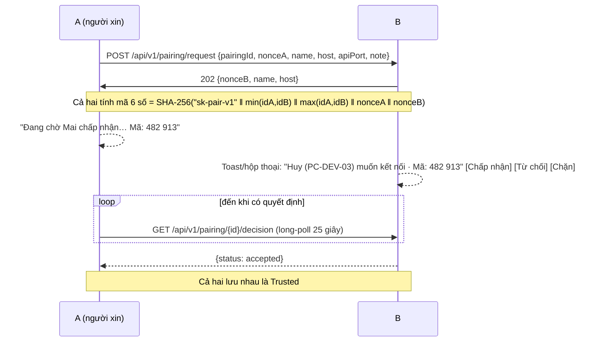

# 04 — Danh tính, Tin cậy & Quyền hạn

> Yêu cầu liên quan: FR-10 → FR-14, NFR-09. Nếu công ty có AD, xem thêm [13-active-directory.md](13-active-directory.md).

## 1. Danh tính thiết bị

| Thành phần | Chi tiết |
|---|---|
| Cặp khóa | **ECDSA P-256**, sinh lúc chạy lần đầu, mỗi người dùng Windows một khóa |
| Chứng chỉ | X.509 tự ký, dùng cho TLS server & client, hiệu lực 20 năm |
| **DeviceId** | `base32(SHA-256(SubjectPublicKeyInfo))`, chữ thường, 52 ký tự |
| Hiển thị rút gọn | 8 ký tự đầu: `k3f9-2mxa` |
| Lưu trữ | PFX mã hóa **DPAPI (CurrentUser)** tại `%LOCALAPPDATA%\Shorekeeper\identity.pfx.dpapi` |

- DeviceId gắn chặt với khóa. Muốn mạo danh thì phải có private key.
- Cài lại Windows sẽ sinh DeviceId mới, và phải kết nối lại (có cảnh báo, xem §4.3).
- **Tên hiển thị** mặc định = tên tài khoản Windows (hoặc AD) + tên máy, đổi được. Tên **không phải** định danh.

## 2. Kênh truyền: mutual TLS

- Mọi HTTP giữa peer là **HTTPS** (TLS 1.2 hoặc 1.3 tùy hệ điều hành; Windows 10 chưa có TLS 1.3 phía server), cả hai phía xuất trình cert (mTLS).
- Không có CA. Kiểm tra bằng **fingerprint pinning**:
  - Client: so DeviceId của cert server với DeviceId định kết nối.
  - Server (Kestrel): `ClientCertificateMode.RequireCertificate`, tính DeviceId client, gắn vào `HttpContext.User`.
- Sau khi biết DeviceId của bên gọi, **mọi endpoint kiểm tra quyền theo §3**.

## 3. Nguyên tắc quyền hạn: chưa tin cậy thì không làm được gì

Mạng cho phép kết nối thẳng giữa các VLAN, nên **ai trong LAN cũng chạm được tới app**. Vì vậy mặc định là **từ chối**. Peer chưa được xác nhận chỉ được **xin phép**, không được **làm**.

### 3.1 Mức quan hệ

| Mức | Có được khi nào |
|---|---|
| **Unknown** | Mới thấy qua discovery |
| **Group member** | Cùng nằm trong một nhóm (Host đã duyệt). Chỉ có hiệu lực **trong phạm vi nhóm đó** |
| **Trusted** | Hai người đã **Kết nối** với nhau (§4), hoặc xác minh qua AD ([13](13-active-directory.md)) |
| **Blocked** | Người dùng chặn. Mọi request bị `403`, ẩn khỏi danh sách |

### 3.2 Ma trận quyền

| Hành động (peer X làm với máy tôi) | Unknown | Cùng nhóm | Trusted |
|---|:---:|:---:|:---:|
| Thấy presence của tôi (tên, trạng thái) | ✅ | ✅ | ✅ |
| `GET /hello` (chỉ tên, phiên bản, `caps`) | ✅ | ✅ | ✅ |
| Gửi **yêu cầu kết nối** | ✅ (giới hạn tần suất) | ✅ | — |
| Gửi **yêu cầu vào nhóm** do tôi Host | ✅ (giới hạn tần suất) | — | ✅ |
| **Gửi file cho tôi** (offer) | ❌ | ✅ offer gắn với nhóm chung | ✅ |
| Tải file tôi gửi | Chỉ khi X nằm trong danh sách người nhận của offer đó, và X phải là Trusted hoặc cùng nhóm | | |
| Lấy danh sách peer tôi biết (PEX) | ❌ | ❌ | ✅ |
| Nhận danh sách thành viên + địa chỉ của nhóm | ❌ | ✅ | — |

- Request bị từ chối trả `403 not_trusted`. **Không tiết lộ thêm thông tin** (không nói mình có nhóm gì, có file gì).
- Giới hạn tần suất với Unknown: ≤ 3 yêu cầu kết nối / 10 phút / DeviceId, ≤ 20 yêu cầu đang chờ trên toàn máy. Bị từ chối 3 lần liên tiếp thì tự im lặng 24 giờ với DeviceId đó.
- **Không có chính sách "cho người lạ gửi file".** Muốn gửi thì phải Kết nối hoặc vào chung nhóm trước.

## 4. Kết nối (thiết lập tin cậy)

Đây là thao tác **"Kết nối"** trên UI: một bên xin, bên kia chấp nhận.

- **Người xin chờ bằng long-poll**, nên chỉ cần A kết nối được tới B. B chỉ ghi nhận "đã kết nối" khi A đã nhận được câu trả lời, nhờ vậy hai bên không lệch trạng thái. B chặn A trong lúc chờ thì A thấy như bị từ chối.
- **Một bước chấp nhận là đủ.** Mã 6 số hiện ở cả hai màn hình để **đối chiếu nếu muốn chắc chắn** (nói qua điện thoại, nhắn tin). Nếu bị tấn công MITM thì hai mã sẽ khác nhau.
- Yêu cầu hết hạn sau 5 phút.
- Gỡ tin cậy (Ngắt kết nối) làm một phía, phía kia sẽ nhận `403` ở lần gọi sau và tự hạ xuống Unknown.

### 4.1 Vào nhóm cũng là một dạng xác nhận

Host duyệt yêu cầu vào nhóm, tức là Host xác nhận người đó. Các thành viên tin nhau **trong phạm vi nhóm**: gửi file cho nhau được, nhưng không PEX và không tự thành Trusted toàn cục. Chi tiết ở [07](07-groups.md).

### 4.2 Kiểm tra "cùng nhóm" khi nhận offer

Offer có `groupId` → người nhận kiểm tra DeviceId người gửi có trong **danh sách thành viên nhóm mà mình đang giữ** (lấy từ Host, được cache lại). Không có thì `403`.

### 4.3 Cảnh báo đổi khóa

Liên hệ Trusted xuất hiện với DeviceId khác (cùng tên, cùng máy) thì **không tự gộp**, coi là Unknown. UI hiển thị: *"Có thể Huy đã cài lại máy. Kết nối lại để xác minh."*

## 5. Bảo vệ khi nhận file

| Rủi ro | Biện pháp |
|---|---|
| Path traversal (`..\..\Windows`) | Chuẩn hóa `relativePath`; từ chối `..`, đường dẫn tuyệt đối, `:` (ADS), ký tự cấm; kiểm tra đích nằm trong thư mục nhận |
| Tên thiết bị (`CON`, `NUL`…) | Đổi thành `_CON` |
| Đuôi lừa (`hoa-don.pdf.exe`, ký tự RTL) | Loại ký tự điều khiển Unicode; UI hiển thị rõ đuôi thật |
| File thực thi độc | Gắn **Mark of the Web** (`Zone.Identifier`) |
| Đầy đĩa | Kiểm tra dung lượng trống ≥ size + 1 GB trước khi tải |
| Ghi đè | Không bao giờ. Trùng tên thì dùng `ten (1).ext` |
| Spam offer từ người đã tin cậy | ≤ 10 offer/phút/peer; Chặn bằng 1 click |

## 6. Threat model

| Mối đe dọa | Bảo vệ | Ghi chú |
|---|---|---|
| Nghe lén LAN | ✅ | TLS 1.2/1.3 |
| Máy lạ ở VLAN khác dò/khai thác API | ✅ | Mặc định từ chối; Unknown chỉ gọi được 3 endpoint (hello, xin kết nối, xin vào nhóm), có giới hạn tần suất |
| Giả mạo presence UDP | ⚠️ | Chỉ là gợi ý; danh tính xác minh khi handshake TLS |
| MITM | ⚠️ | Mã 6 số để đối chiếu (không bắt buộc) |
| Giả danh bằng tên | ✅ | Tin cậy dựa trên DeviceId; cảnh báo trùng tên |
| Host nhóm độc hại | ⚠️ | Có thể thêm người vào nhóm; thành viên vẫn thấy rõ ai gửi và tự quyết định có nhận không |
| Người không được chọn tải file | ✅ | Người gửi kiểm tra DeviceId có trong danh sách người nhận của offer |
| Máy bị chiếm quyền | ❌ | Ngoài phạm vi |
| Rò rỉ ra ngoài | ✅ | Không kết nối Internet, không telemetry |

## 7. Chính sách IT (GPO)

| Khóa (`HKLM\Software\Policies\Shorekeeper`) | Kiểu | Ý nghĩa |
|---|---|---|
| `ApplyMarkOfTheWeb` | dword | Gắn MOTW cho file nhận |
| `MaxOfferSizeGB` | dword | Giới hạn tổng size mỗi offer |
| `AllowedSubnets` | multi-string | Chỉ giao tiếp với các dải này |
| `DisableGroups` | dword | Tắt tính năng nhóm |
| `AllowBridge` | dword | Cho phép người dùng bật Bridge |
| `AuditLog` | dword | Ghi log gửi/nhận |
