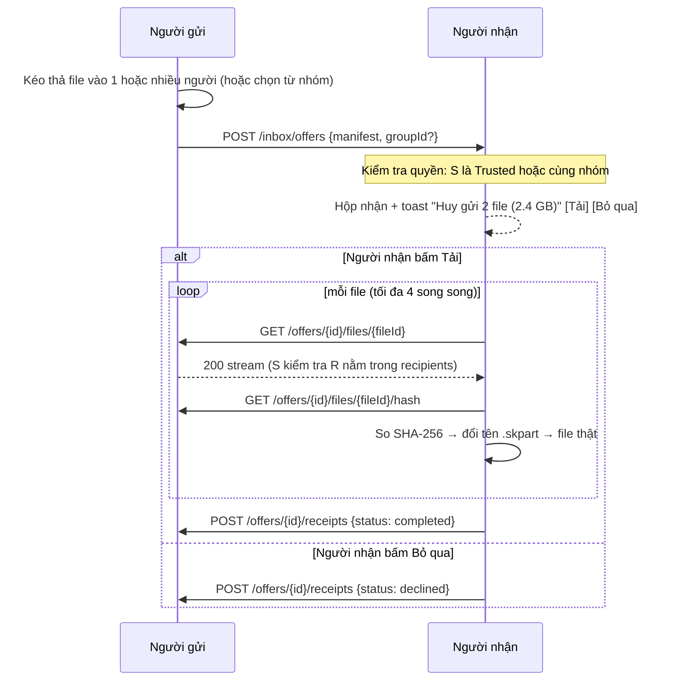

# 06 — Gửi file (luồng chính)

> Yêu cầu liên quan: FR-20 → FR-28, NFR-01, NFR-04, NFR-07, NFR-08.

## 1. Nguyên tắc

1. **Người gửi là chủ file.** Người gửi quyết định gửi **cho ai**: một người, nhiều người, hoặc chọn từ thành viên nhóm.
2. **Người nhận tự quyết.** Họ thấy file trong **Hộp nhận**, muốn tải thì tải, không thì bỏ qua. Không ai bị ép nhận.
3. **Gửi = copy.** Tải xong thì file là của người nhận, **vĩnh viễn**. File gốc của người gửi không bị động tới.
4. **Rớt mạng ngắn thì tự nối lại và tải tiếp**. Không nối lại được trong thời gian chờ thì **Lỗi**.
5. **Một cơ chế cho mọi trường hợp.** 1–1, gửi nhiều người, gửi trong nhóm đều là một **Offer** với danh sách người nhận.

## 2. Offer

```text
Offer (thuộc người gửi)
├── offerId, createdAt, note
├── files[]:       relativePath, size, modifiedAt
├── recipients[]:  DeviceId (+ groupId nếu chọn từ nhóm)
└── state:         Open → Closed (người gửi thu hồi / hết hạn)
```

- Offer **mở** cho đến khi: người gửi **thu hồi**, hoặc **hết hạn** (mặc định 24 giờ, đổi trong Cài đặt), hoặc **mọi người nhận đã xong/từ chối**.
- Offer được lưu trong DB của người gửi. App khởi động lại thì offer vẫn mở (nếu chưa hết hạn).
- Khi Offer còn mở, người nhận chỉ tải được lúc **người gửi đang online**. Người gửi offline thì Hộp nhận hiện *"Người gửi offline"*.

## 3. Luồng



### 3.1 Giao offer tới người nhận

- Người gửi `POST /inbox/offers` tới từng người nhận **đang online**.
- Người nhận đang **offline**: người gửi giữ lại, và tự giao khi thấy họ online (còn trong thời hạn offer).
- Người gửi **thu hồi**: gửi `POST /inbox/offers/{id}/withdrawn` tới những ai đã nhận thông báo. Hộp nhận của họ ghi "Đã thu hồi". Ai đang tải dở thì bị dừng; ai đã tải xong thì **vẫn giữ file**.

### 3.2 Người nhận chọn

- **Tải tất cả**, **chọn một số file**, **Bỏ qua** (báo cho người gửi), hoặc **để đó** (quyết sau, khi offer còn mở).
- **Tự nhận** (tùy chọn theo từng liên hệ Trusted, có giới hạn size): tự tải ngay khi offer đến.

## 4. Trạng thái

### Phía người gửi (từng người nhận)

```text
Pending (chưa giao) ─► Delivered ─► Downloading ─► Completed
                          │              │
                          ├─ Declined     └─ Failed (người nhận có thể tải lại khi offer còn mở)
                          └─ (offer hết hạn / thu hồi) ─► Closed
```

Màn hình người gửi hiện từng người nhận: *"Mai ✅ · Tuấn ⬇ 45% · Minh ⏸ chưa mở · Lan ✖ bỏ qua"*.

### Phía người nhận (từng file)

```text
Available ──[Tải]──► Downloading ⇄ Reconnecting ──► Verifying ──► Completed
    │                     │             │
    │                     │             └─ quá thời gian chờ ──► Failed ──[Tải lại]──► Downloading (từ đầu)
    └─[Bỏ qua]─► Declined └─[Hủy]─► Cancelled
```

## 5. Rớt mạng: nối lại và tải tiếp

Rớt Wi-Fi vài giây, rút cắm dây, đổi mạng, hay máy bên kia lag… thì **không hỏng transfer**.

| Bước | Hành vi |
|---|---|
| 1 | Stream lỗi (socket reset, timeout 15 giây không có byte) → trạng thái **Reconnecting**. Giữ nguyên `.skpart` và trạng thái hash trong bộ nhớ |
| 2 | Thử lại sau 1s, 2s, 4s, 8s, 15s, 30s… Mỗi lần thử, Connector chọn lại địa chỉ (người gửi có thể đã đổi IP) |
| 3 | Kết nối lại được → `GET` với **`Range: bytes=<số byte đã nhận>-`** và `If-Range: <ETag>` → **tải tiếp từ chỗ dở** |
| 4 | Tổng thời gian chờ vượt **cửa sổ kết nối lại** (mặc định **60 giây**, cấu hình được 15–300 giây) → **Failed**, xóa `.skpart` |
| 5 | Người gửi báo offline (bye/Offline) giữa chừng → vẫn chờ hết cửa sổ, vì có thể họ chỉ đổi mạng |

- **ETag** = hash của `(size, modifiedAt)` file nguồn. File nguồn đổi trong lúc chờ → `If-Range` không khớp → Failed với lý do *"File gốc đã bị thay đổi"*.
- Chỉ tải tiếp **trong cùng phiên chạy app**. Thoát app / máy nhận tắt → `.skpart` bị xóa lúc khởi động lại. Nếu offer còn mở thì người nhận bấm **Tải lại** (từ đầu).
- UI: *"Mất kết nối với Huy — đang thử lại (còn 42 giây)…"* với nút [Hủy].

## 6. Người gửi: đọc file

- **Mặc định đọc thẳng file gốc**, không tạo bản sao (Q14 đã chốt).
  - Trong lúc **đang stream**, mở với `FileShare.Read`: ứng dụng khác đọc được nhưng không ghi được, nên dữ liệu nhất quán.
  - Giữa các lần tải (offer đang mở, chưa ai tải), file **không bị khóa**. Mỗi lần phục vụ đều kiểm tra `size` + `modifiedAt`. Nếu thay đổi thì file đó chuyển trạng thái *"Đã thay đổi"*, người gửi nhận thông báo kèm nút **[Gửi bản mới]** (tạo offer mới).
- **Snapshot** (bản sao tạm):
  - Tự hỏi khi file đang bị ứng dụng khác mở ghi (không mở được với `FileShare.Read`).
  - Tùy chọn "**Luôn sao chép tạm trước khi gửi**" trong Cài đặt: người gửi sửa tiếp file gốc thoải mái.
  - Snapshot nằm ở `%LOCALAPPDATA%\Shorekeeper\snapshots\{offerId}\`, bị xóa khi offer đóng.
- **Hash:** tính SHA-256 **một lần** cho mỗi file trong nền, ngay khi có người bắt đầu tải (cache theo path + size + mtime), dùng chung cho mọi người nhận.
- Kestrel phục vụ với `enableRangeProcessing: true`, buffer 1 MiB, `FileOptions.SequentialScan`.

## 7. Người nhận: ghi file

```text
Downloads\Shorekeeper\
├── app-1.4.2.zip.skpart     ← đang nhận
└── release-notes.pdf        ← đã xong
```

1. Tạo `.skpart`, cấp phát trước bằng `SetLength`.
2. Ghi tuần tự, tính SHA-256 incremental (`IncrementalHash`). Khi nối lại, tiếp tục đúng từ offset đã có, nên trạng thái hash vẫn đúng.
3. Đủ byte → so với hash của người gửi.
4. Khớp → đổi tên (trùng tên thì `ten (1).ext`), đặt `LastWriteTime` gốc, gắn MOTW.
5. Không khớp → Failed, xóa `.skpart`.
6. Khởi động app → xóa mọi `.skpart` còn sót.

Nơi lưu mặc định: `%USERPROFILE%\Downloads\Shorekeeper\`. Có tùy chọn thư mục con theo người gửi, và nút "Tải vào…" để chọn nơi khác.

## 8. Lỗi

| Tình huống | Kết quả |
|---|---|
| Rớt mạng ngắn | Reconnecting → tải tiếp |
| Không nối lại được sau 60 giây | Failed, xóa `.skpart`; [Tải lại] nếu offer còn mở |
| Người gửi thu hồi | Dừng, "Đã thu hồi" |
| Người nhận hủy | Cancelled |
| File nguồn bị đổi | Failed: "File gốc đã bị thay đổi" |
| Hết dung lượng | Failed, xóa `.skpart` |
| Hash không khớp | Failed: "Dữ liệu hỏng khi truyền"; [Tải lại] |
| Thoát app | Mọi transfer đang chạy → Failed |

Thông báo luôn nói bằng lời thường và kèm nút hành động.

## 9. Gửi thư mục

- Duyệt đệ quy, `relativePath` dùng `/`; thư mục rỗng là mục `isDirectory`.
- Bỏ qua symlink/junction, `desktop.ini`, `Thumbs.db` (có tùy chọn bật).
- Hỗ trợ đường dẫn dài (`longPathAware`).
- Nhiều file nhỏ: 4 file song song, giữ kết nối keep-alive.

## 10. Hiệu năng

| Kỹ thuật | Tác dụng |
|---|---|
| TLS 1.3 AES-GCM (AES-NI) | Mã hóa không phải nút thắt ở 1 Gbps |
| Buffer 1 MiB, `ArrayPool` | Ít syscall, ít rác GC |
| Hash incremental phía nhận, hash cache phía gửi | Không đọc lại file khi không cần |
| Cấp phát trước `.skpart` | Ghi liền mạch, phát hiện thiếu chỗ sớm |
| Người gửi giới hạn 16 stream đồng thời | Không làm treo máy khi nhiều người cùng tải |

Mục tiêu ≥ 90 MB/s trên 1 Gbps (NFR-01). Nếu một luồng TLS không đủ nhanh trên mạng > 1 Gbps, có thể chia file lớn thành vài `Range` song song trong cùng một lần tải. Cơ chế Range đã có sẵn cho việc nối lại.
