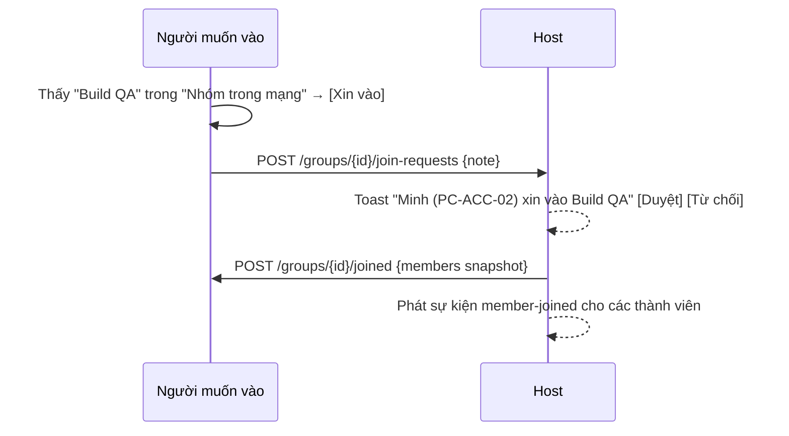

# 07 — Nhóm

> Yêu cầu liên quan: FR-30 → FR-34.

## 1. Nhóm để làm gì

Nhóm **chỉ là một danh sách thành viên** do một máy (Host) quản lý. Nhóm **không chứa file**. Nhóm giúp:

1. **Chọn người nhận nhanh:** gửi file → chọn "Build QA (cả nhóm)" hoặc tick vài thành viên.
2. **Cho phép gửi file cho nhau** mà không cần Kết nối từng cặp. Host duyệt người vào, tức là đã xác nhận người đó ([04 §4.1](04-identity-security.md)).
3. **Thấy nhau khác subnet:** Host cho thành viên biết địa chỉ của nhau.

Gửi file trong nhóm dùng **đúng cơ chế Offer** ở [06](06-file-transfer.md): người gửi chọn người nhận, người nhận tự quyết tải hay không.

## 2. Tạo nhóm

- Ai cũng tạo được, chỉ cần đặt tên. Máy người tạo là **Host**.
- Nhóm hiện với mọi người trong LAN (qua presence của Host) trong mục **"Nhóm trong mạng"**.
- Nhóm lưu trên máy Host. Host tắt/mở app thì nhóm vẫn còn.

## 3. Vào nhóm

- **Chỉ có một cách: xin vào → Host duyệt.**
- Host muốn thêm người thì bấm "Mời" trên thẻ người đó. Người kia nhận lời mời và đồng ý là vào (đồng ý 2 phía, giống xin vào nhưng ngược chiều).
- Người từng bị từ chối 3 lần thì nút [Xin vào] bị khóa 24 giờ với nhóm đó.

## 4. Thành viên ↔ Host

- Thành viên giữ **event stream (SSE)** tới Host: `member-joined`, `member-left`, `member-online` / `member-offline` (**kèm địa chỉ**), `group-renamed`, `group-closed`.
- Thành viên **cache danh sách thành viên** gần nhất.
- **Host offline:** nhóm hiện *"Host offline"*. Thành viên **vẫn gửi file cho nhau được** dựa trên danh sách đã cache. Chỉ là không vào/ra thành viên mới được cho đến khi Host online lại.
- SSE rớt thì tự nối lại với backoff và lấy lại snapshot.

## 5. Quyền trong nhóm

| Hành động | Host | Thành viên |
|---|:---:|:---:|
| Gửi file cho thành viên khác (chọn cả nhóm hoặc từng người) | ✅ | ✅ |
| Duyệt / mời / loại thành viên | ✅ | ❌ |
| Đổi tên, đóng nhóm | ✅ | ❌ |
| Rời nhóm | — | ✅ |

## 6. Rời / bị loại / đóng nhóm

- **Rời:** báo Host → Host phát `member-left`.
- **Bị loại:** Host phát `member-left`. Người bị loại nhận `group-closed` với chính họ. Từ đó thành viên khác từ chối offer từ người này (nếu không phải Trusted riêng).
- **Đóng nhóm:** Host phát `group-closed` và xóa nhóm. Thành viên offline sẽ biết khi kết nối lại (Host trả `404`).
- File đã gửi/nhận trước đó **không bị ảnh hưởng**: của ai vẫn là của người đó.

## 7. Giới hạn

| Tham số | Giá trị |
|---|---|
| Thành viên / nhóm | 100 |
| Nhóm Host / máy | 10 |
| Nhóm tham gia / máy | 50 |
