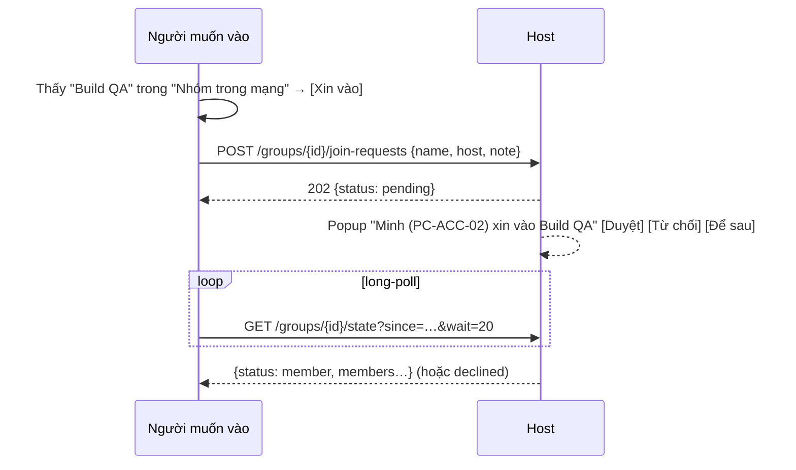

# 07 — Nhóm

> Yêu cầu liên quan: FR-30 → FR-34.

## 1. Nhóm để làm gì

Nhóm **chỉ là một danh sách thành viên** do một máy (Host) quản lý. Nhóm **không chứa file**. Nhóm giúp:

1. **Chọn người nhận nhanh:** gửi file → chọn "Build QA (cả nhóm)" hoặc tick vài thành viên.
2. **Cho phép gửi file cho nhau** mà không cần Kết nối từng cặp. Host duyệt người vào, tức là đã xác nhận người đó ([04 §4.1](04-identity-security.md)).
3. **Thấy nhau khác subnet:** Host cho thành viên biết địa chỉ của nhau.

Gửi file trong nhóm dùng **đúng cơ chế Offer** ở [06](06-file-transfer.md): người gửi chọn người nhận, người nhận tự quyết tải hay không.

## 2. Tạo nhóm

- Ai cũng tạo được, chỉ cần đặt tên. Máy người tạo là **Host**.
- Nhóm hiện với mọi người trong LAN (qua presence của Host) trong mục **"Nhóm trong mạng"**.
- Nhóm lưu trên máy Host. Host tắt/mở app thì nhóm vẫn còn.

## 3. Vào nhóm

- **Chỉ có một cách: xin vào → Host duyệt.** Người xin chờ bằng long-poll, nên Host không cần gọi ngược được tới người xin, và người xin offline lúc Host duyệt vẫn biết khi mở lại app (yêu cầu đang chờ được lưu ở cả hai phía).
- Host muốn thêm người thì bấm **"Mời…"** trên nhóm và tick người đang online. Người kia nhận popup và đồng ý là vào. Lời mời là một **duyệt trước**: khi người được mời đồng ý, app của họ gửi yêu cầu vào nhóm như thường và Host cho vào ngay.
- Người từng bị từ chối 3 lần thì yêu cầu bị khóa 24 giờ với nhóm đó (`429`). Mỗi DeviceId gửi tối đa 5 yêu cầu (hoặc lời mời) / 10 phút; mỗi nhóm tối đa 50 yêu cầu đang chờ.

## 4. Thành viên ↔ Host

- Mỗi nhóm, thành viên **long-poll** `GET /groups/{id}/state?since=<version>&wait=20` tới Host (thay cho SSE, ADR-011). Có thay đổi (vào, rời, bị loại, đổi tên, đóng) thì Host trả ngay; không thì trả sau tối đa 20 giây. Mỗi câu trả lời có **danh sách thành viên kèm địa chỉ** mà Host đang thấy (trống khi offline).
- Thành viên **cache danh sách thành viên** gần nhất (SQLite).
- Địa chỉ thành viên mà mình chưa nghe trực tiếp được đưa vào **probe** ([03 §4](03-discovery-presence.md)): trả lời thì hiện trong "Xóm" với nhãn *"Cùng nhóm Build QA"*, kể cả khác subnet.
- **Host offline:** nhóm hiện *"Host offline"*. Thành viên **vẫn gửi file cho nhau được** dựa trên danh sách đã cache. Chỉ là không vào/ra thành viên mới được cho đến khi Host online lại. Không gọi được Host thì thử lại sau 15 giây.

## 5. Quyền trong nhóm

| Hành động | Host | Thành viên |
|---|:---:|:---:|
| Gửi file cho thành viên khác (chọn cả nhóm hoặc từng người) | ✅ | ✅ |
| Duyệt / mời / loại thành viên | ✅ | ❌ |
| Đổi tên, đóng nhóm | ✅ | ❌ |
| Rời nhóm | — | ✅ |

## 6. Rời / bị loại / đóng nhóm

- **Rời:** `POST /groups/{id}/leave` → Host bỏ khỏi danh sách, các thành viên khác thấy ở lần poll sau. Host offline thì vẫn rời ở phía mình.
- **Bị loại:** Host bỏ khỏi danh sách. Lần poll sau người bị loại nhận `404` và xóa nhóm (có thông báo). Từ đó thành viên khác (sau khi cập nhật danh sách) và chính Host từ chối offer từ người này, cũng như không cho tải file đã gửi qua nhóm (nếu không phải Trusted riêng).
- **Đóng nhóm:** Host xóa nhóm. Thành viên biết qua `404` ở lần poll sau, kể cả khi đang offline lúc đóng.
- File đã gửi/nhận trước đó **không bị ảnh hưởng**: của ai vẫn là của người đó.

## 7. Gửi file trong nhóm

- Offer gửi cho thành viên mang `groupId`. Người nhận chấp nhận khi người gửi là Trusted, **hoặc** cả hai cùng trong nhóm `groupId` theo danh sách mình đang giữ ([04 §4.2](04-identity-security.md)). Người gửi kiểm tra tương tự khi người nhận tải.
- Gửi từ trang Nhóm: kéo file vào nhóm (hoặc [Gửi file cho nhóm]) → hộp chọn người nhận, mặc định tick cả nhóm trừ mình.
- Gửi từ "Xóm": thẻ của người cùng nhóm (chưa Kết nối) cũng nhận file khi kéo thả / menu chuột phải, offer gắn với nhóm chung.
- Tự nhận file chỉ áp dụng cho liên hệ Trusted, không áp dụng cho thành viên nhóm.

## 8. Giới hạn

| Tham số | Giá trị |
|---|---|
| Thành viên / nhóm | 100 |
| Nhóm Host / máy | 10 |
| Nhóm tham gia / máy | 50 |
| Tên nhóm | 1–40 ký tự |
| Nhóm hiện trong presence | 5 (bớt nhóm cuối nếu gói UDP quá 1.200 byte) |

GPO `DisableGroups = 1` tắt toàn bộ: không tạo/vào/mời, không quảng bá nhóm, endpoint nhóm trả `404`, và chỉ nhận file từ liên hệ Trusted.
