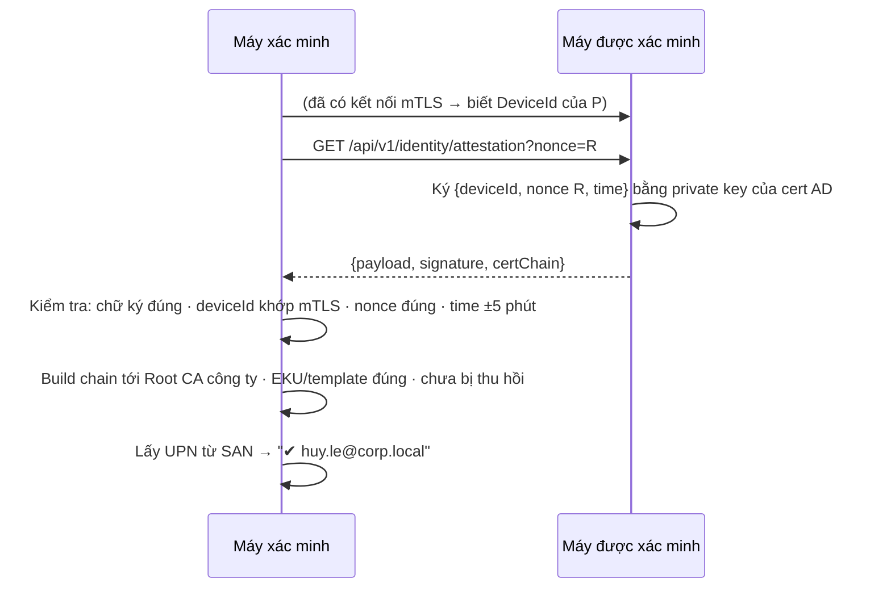

# 13 — Tích hợp Active Directory (tùy chọn)

> Không có AD thì app vẫn chạy đầy đủ theo các tài liệu 01–12. Phần này mô tả những gì **thêm được** nếu công ty có AD, chia theo mức từ dễ đến khó.

## 1. Tổng quan các mức

| Mức | Được gì | Cần gì | Công sức |
|---|---|---|---|
| **1. Thông tin người dùng** | Tên thật, phòng ban, chức danh, ảnh đại diện; tìm/nhóm theo phòng ban | Máy join domain | Thấp, không cần IT làm gì |
| **2. Quản lý tập trung** | Cài hàng loạt, chính sách, chỉ định Bridge | GPO | Thấp, IT cấu hình |
| **3. Xác minh danh tính bằng chứng chỉ công ty** | Biết chắc "đây đúng là huy.le@corp.local", **tự tin cậy đồng nghiệp, không cần bấm Kết nối**, chặn máy ngoài công ty | **AD CS** (Enterprise CA) | Trung bình |
| **4. Nhóm theo AD group** | Nhóm "Dev-Team" tự nhận đúng thành viên phòng ban | Mức 3 | Trung bình |

App tự phát hiện máy có join domain không (`Domain.GetComputerDomain()`) để bật mức 1. Mức 3–4 bật theo chính sách GPO.

## 2. Mức 1 — Thông tin người dùng từ AD

- Đọc thuộc tính của **người dùng hiện tại**: `displayName`, `department`, `title`, `mail`, `thumbnailPhoto` (qua `System.DirectoryServices.AccountManagement` → `UserPrincipal.Current`, và `DirectoryEntry` để lấy ảnh).
- Cache lại. Không kết nối được DC (làm việc offline) thì dùng bản cache.
- Presence UDP chỉ mang tên + phòng ban (gói nhỏ). Ảnh lấy qua `GET /api/v1/hello/avatar` khi cần.
- UI: thẻ hiện ảnh + phòng ban; danh sách "Xóm" nhóm theo phòng ban; tìm theo tên/phòng ban/email.

> ⚠️ Ở mức 1, thông tin là do **máy kia tự khai**. Ai cũng có thể sửa app để khai tên người khác. UI vẫn hiển thị "⚠ Chưa kết nối" cho đến khi Kết nối (hoặc có mức 3).

Thêm vào thiết kế: interface `IDirectoryInfo` trong Core, hiện thực trong `Platform.Windows`.

## 3. Mức 2 — Quản lý tập trung qua GPO

Đã thiết kế ở [11](11-windows-deployment.md):

- Cài MSI hàng loạt bằng GPO Software Installation / Intune.
- ADMX: giới hạn size, thời hạn offer, thư mục nhận, audit…
- `EnableBridge` trên vài máy chỉ định + `BridgeAddresses` cho mọi máy, nên **khác subnet tự thấy nhau ngay từ lần đầu**.
- (Tùy chọn) DNS SRV `_shorekeeper._tcp.<domain>` trỏ tới máy Bridge.

## 4. Mức 3 — Xác minh danh tính bằng chứng chỉ công ty

### 4.1 Ý tưởng

Mỗi người dùng domain được AD CS **tự động cấp** (auto-enrollment) một chứng chỉ, trong đó có UPN (`huy.le@corp.local`). Máy nào cũng tin CA của công ty (AD tự phân phối Root CA cho máy domain). App dùng chứng chỉ này để **chứng minh** DeviceId của mình thuộc về tài khoản AD nào.

### 4.2 Vì sao không dùng thẳng chứng chỉ AD làm cert TLS

- DeviceId phải **ổn định**. Cert AD được gia hạn định kỳ (thường 1 năm) và có thể đổi khóa.
- App phải chạy được cả khi không có AD.

→ Vẫn dùng **khóa thiết bị** cho mTLS như cũ, và thêm một bước **attestation** (chứng thực).

### 4.3 Luồng attestation

- Private key của cert AD nằm trong Windows cert store (có thể trên TPM, không export được). App ký qua CNG, không bao giờ đọc được khóa.
- Kết quả được cache theo DeviceId và kiểm tra lại mỗi 24 giờ hoặc khi cert AD đổi.

### 4.4 Tác dụng

| Chính sách (GPO) | Hiệu ứng |
|---|---|
| `TrustDirectoryVerifiedPeers = 1` | Peer đã xác minh AD được coi là **Trusted** luôn, **không cần bấm Kết nối** |
| `RequireDirectoryVerified = 1` | Chỉ giao tiếp với peer đã xác minh AD, **chặn máy cá nhân / máy ngoài domain** |
| `AttestationTemplateOid` | OID template chứng chỉ được chấp nhận |

UI: thẻ hiện `✔ Đã xác minh · huy.le@corp.local` thay vì "⚠ Chưa kết nối".

### 4.5 IT cần chuẩn bị

1. Có **AD CS Enterprise CA**. Nếu chưa có thì mức 3 không áp dụng được, nhưng mức 1–2 vẫn dùng bình thường.
2. Tạo template chứng chỉ người dùng (vd "Shorekeeper User"): EKU Client Authentication, Subject Alternative Name chứa UPN, khóa không export được.
3. Bật **auto-enrollment** bằng GPO cho nhóm người dùng.
4. Đảm bảo CRL/OCSP truy cập được trong LAN. Nếu không kiểm tra được thu hồi, app chấp nhận ở chế độ "soft-fail" và ghi log (cấu hình được).

### 4.6 Vì sao không dùng Kerberos/NTLM (Windows Integrated Auth)

- Kerberos cần một **service account/SPN** cho phía nhận. App chạy trong phiên người dùng, trên hàng trăm máy, không có SPN riêng, nên không nhận được service ticket.
- NTLM đã bị Microsoft đưa vào lộ trình loại bỏ, bảo mật yếu, và thường bị IT chặn.
- Chứng chỉ + attestation hoạt động ngang hàng, không cần gọi về DC mỗi lần kết nối.

## 5. Mức 4 — Nhóm theo AD group

- Khi tạo nhóm, Host chọn **liên kết với AD security group** (vd `CORP\Dev-Team`).
- Peer xin vào nhóm → Host kiểm tra UPN (đã xác minh ở mức 3) có thuộc AD group không (LDAP, tính cả nhóm lồng nhau) → **tự duyệt**.
- Tùy chọn: Host tự **mời** mọi thành viên AD group đang online.
- Người rời phòng ban (bị gỡ khỏi AD group) → Host kiểm tra lại định kỳ (mỗi 1 giờ) và loại khỏi nhóm.

## 6. Thay đổi so với thiết kế gốc

| Tài liệu | Thay đổi |
|---|---|
| [04](04-identity-security.md) | Thêm mức tin cậy **DirectoryVerified** (tương đương Trusted, nguồn là AD) |
| [05](05-protocol.md) | Thêm `GET /identity/attestation?nonce=`, `GET /hello/avatar` |
| [09](09-data-storage.md) | `Peers.DirectoryUpn` (đã có), thêm `Groups.DirectoryGroupSid` |
| [11](11-windows-deployment.md) | Thêm các chính sách ở §4.4 |
| [12](12-roadmap.md) | Mức 1–2 ở M4/M6; mức 3–4 ở M6 nếu công ty có AD CS |
